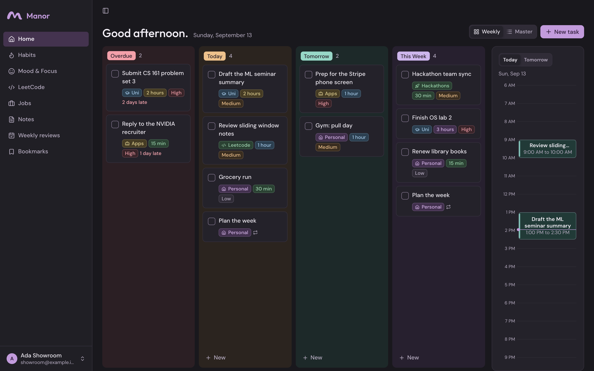
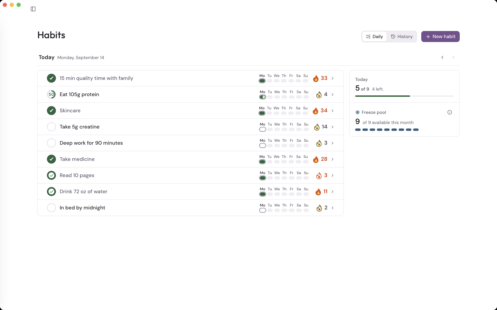
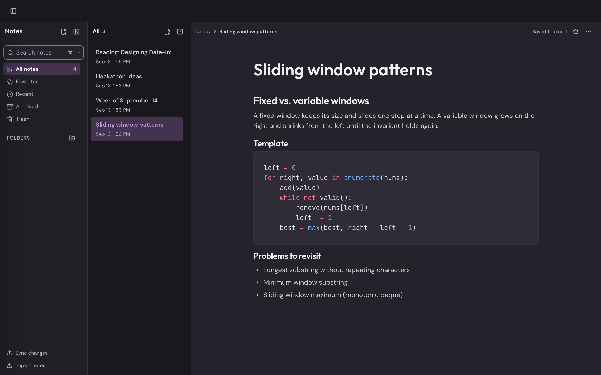
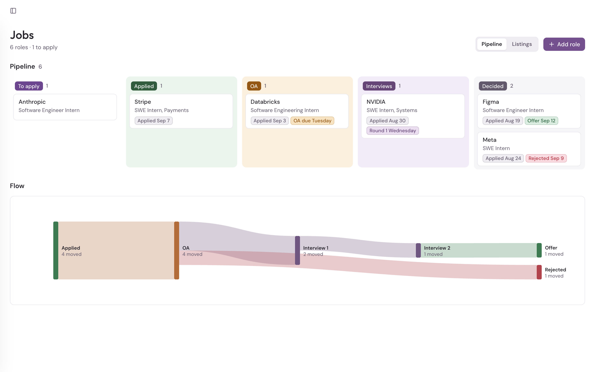
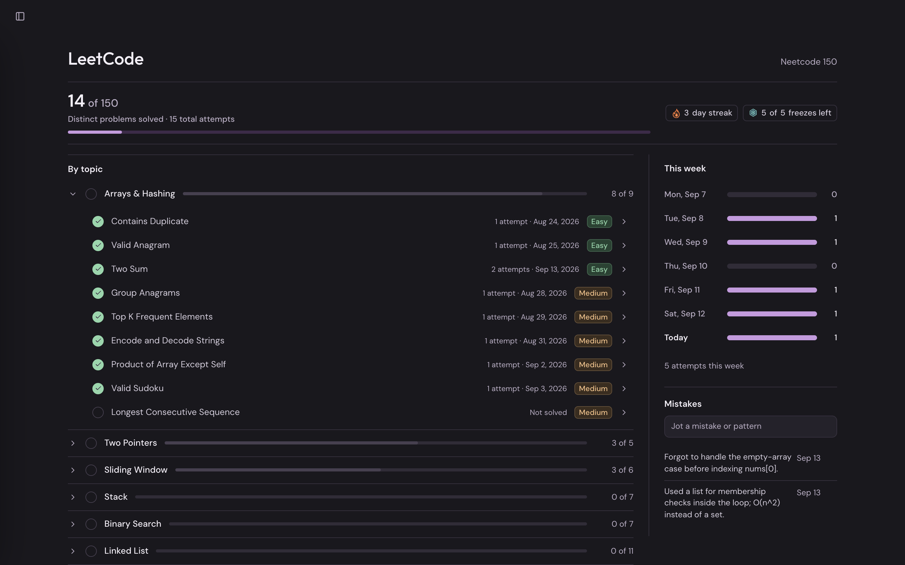

<p align="center">
  
</p>

<h1 align="center">Manor</h1>

<p align="center">
  A personal productivity app for tasks, habits, mood, LeetCode practice, job applications, and notes.<br>
  Use it directly, or let an AI agent work in it over MCP.
</p>

<p align="center">
  
  
  
  
</p>

<p align="center">
  
</p>

Manor replaces a sprawling Notion setup with one place that is cheap to keep current. Every change, whether it comes from the interface or from an agent, goes through the same command boundary: idempotent, revision-checked, receipted, and recorded in a durable action history.

## Contents

- [Key features](#key-features)
- [How it works](#how-it-works)
- [Working with an agent](#working-with-an-agent)
- [Running it](#running-it)
- [Repository layout](#repository-layout)
- [Documentation](#documentation)
- [Status](#status)
- [Credits](#credits)

## Key features

- **Home.** A due-bucket task board (Overdue, Today, Tomorrow, This Week) beside a single-column timeline of your Google Calendar events and disposable time blocks. Recurring tasks track each occurrence independently.
- **Habits.** Daily check-offs with per-habit streaks, a shared monthly freeze pool spent by hand, Earn-Back recovery, and month grids with 3, 6, and 12-month completion trends.
- **Mood and focus.** One-tap ratings for today or yesterday, history corrections for any past day, and a single evolving synthesis per day written from your debriefs.
- **LeetCode.** The NeetCode 150 curriculum with attempt history, saved solution source, daily intensity, a separate streak, and a mistakes log.
- **Jobs.** A browsable internship catalog ingested from SimplifyJobs, an application board from To apply through Offer, stage history with dates, and named resume versions.
- **Notes.** A Notion-style block editor with columns, tabs, media, equations, and a live table of contents. Drafts are protected on the device before they sync, conflicts surface instead of overwriting, and seven days of versions can be restored.
- **Knowledge base.** X bookmarks and agent-supplied captures with text and semantic search.
- **Weekly reviews.** A scheduled review of habits, mood, focus, and task completion, generated by a hosted ChatGPT task and saved back into Manor.

The sidebar docks or collapses to a hover overlay; it is docked above and collapsed below. Light and dark modes are both first-class.

<table>
  <tr>
    <td width="50%"></td>
    <td width="50%"></td>
  </tr>
  <tr>
    <td width="50%"></td>
    <td width="50%"></td>
  </tr>
</table>

## How it works

1. The React app talks to Supabase directly: Postgres for records, private Storage for files, Realtime for change notifications, Edge Functions for anything that needs a secret.
2. Every mutation is a named command executed in a transaction. Commands carry an idempotency key and an expected revision, return a receipt with the committed record, and write field-level events to an account-scoped history.
3. Agents reach the same commands through a remote MCP endpoint secured by OAuth 2.1 with per-client read or read/write scope. There is no separate agent database access.
4. Background workers own the outside world: Google Calendar syncs every minute, X bookmarks and the jobs catalog refresh on schedules, an embedding worker indexes notes and captures, and a maintenance job materializes recurrences, reconciles streaks, and purges Trash after seven days.
5. Notes edits are written to IndexedDB before any network call, replayed in order per note, and merged against the server revision, so a dropped connection or a reload never loses typing.

## Working with an agent

Manor exposes 112 operations (46 reads, 66 writes) at `https://<project-ref>.supabase.co/functions/v1/manor-mcp`. Connect it as an MCP server in ChatGPT, Codex, or any OAuth-capable client, approve the client on Manor's consent screen, and ask for work in plain language:

- "Add this posting to my applications and attach the resume I used for NVIDIA."
- "Read my inbox and create tasks for anything with a deadline this week."
- "Let's debrief today, then update my daily synthesis."

Reads return record IDs and revisions; writes require them, so an agent cannot accidentally touch records that started matching a filter after it looked. Bulk operations are bounded and report per-item results. What the agent can read is exactly what you can.

## Running it

**Requirements:** Node 24, a Supabase project, a Google OAuth web client, and (for full functionality) Google Calendar, X, and OpenAI credentials configured as function secrets.

```sh
npm --prefix app ci
npm --prefix app run dev        # unauthenticated UI work on http://127.0.0.1:5173
npm --prefix app run typecheck
npm --prefix app test
npm --prefix app run build      # writes app/dist/
```

The browser needs two values, supplied through the environment or the deployment platform:

```
VITE_SUPABASE_URL=https://<project-ref>.supabase.co
VITE_SUPABASE_PUBLISHABLE_KEY=sb_publishable_...
```

Backend changes ship with the Supabase CLI: `npx supabase db push` for migrations and `npx supabase functions deploy --no-verify-jwt` for the ten Edge Functions. Signed-in and end-to-end testing happens on the hosted staging site; localhost is not an authorized origin. Connection settings and verification steps are in the [web app guide](app/README.md); backup credentials and the isolated restore drill are in the [recovery guide](tools/recovery/README.md).

## Repository layout

```
app/src/ui/        React components, pages, styles, and showroom fixtures
app/src/shared/    Domain types, validation, and calculations
app/src/web/       Auth, Supabase adapters, Notes drafts, service layer
supabase/          Migrations, the MCP endpoint, ingestion and maintenance workers
tools/recovery/    Encrypted backups (restic + rclone) and isolated restore
tools/diagrams/    Excalidraw scenes and SVG export for the docs
docs/              PRD, architecture, design charter, research
```

## Documentation

| Document | Owns |
|---|---|
| [PRD](docs/PRD.md) | Product behavior, business rules, and the decision log |
| [Architecture](docs/ARCHITECTURE.md) | Technical design, deployment, migration, recovery, and verification status |
| [Design charter](docs/DESIGN.md) | Visual direction, typography, components, motion |
| [Redesign report](docs/REDESIGN-REPORT.md) | Notion and Mixpanel reference evidence |
| [Agent guide](AGENTS.md) | Conventions for coding agents working in this repository |

## Status

Production runs at [mymanor.vercel.app](https://mymanor.vercel.app) on the migrated Electron-era data. Remaining release items, such as the off-site file backup drill, are tracked in [architecture status](docs/ARCHITECTURE.md#status). Manor is built for one account; collaboration and sharing are out of scope.

## Credits

[BlockNote](https://www.blocknotejs.org/) for the editor, [Supabase](https://supabase.com/) for the backend, [TanStack Query](https://tanstack.com/query) for server state, [Lucide](https://lucide.dev/) for icons, [restic](https://restic.net/) and [rclone](https://rclone.org/) for recovery, and the [Outfit](https://fonts.google.com/specimen/Outfit) and [DM Sans](https://fonts.google.com/specimen/DM+Sans) typefaces under the SIL Open Font License.

This is a personal project. No license is granted for redistribution.
