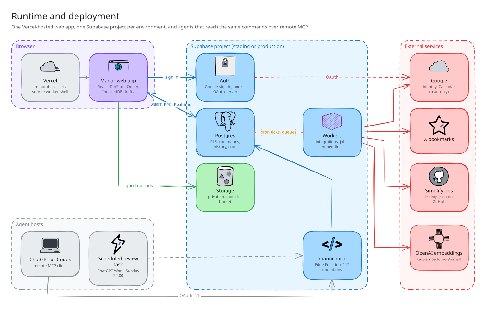
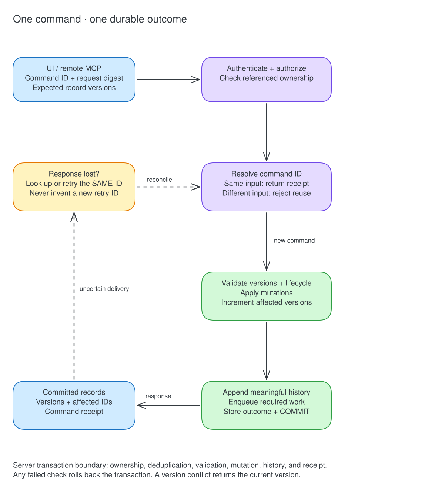
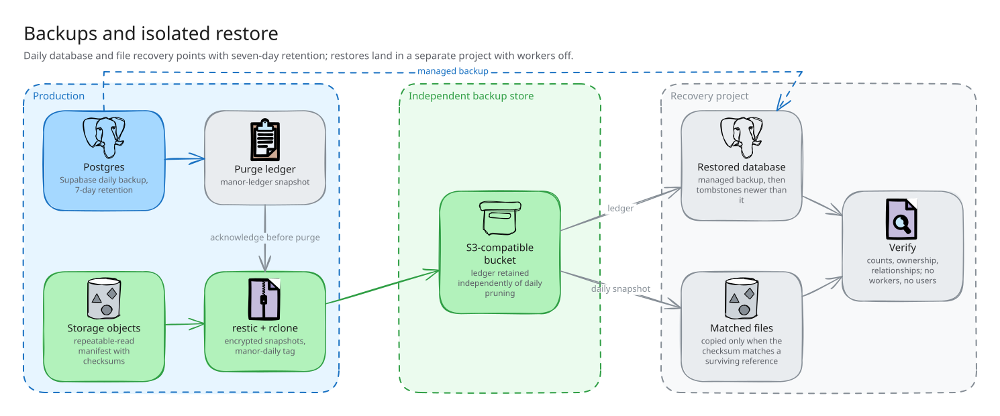

# Manor Architecture

_Last updated: 2026-09-09_

This document owns the technical design of the web migration. [PRD.md](PRD.md) owns product behavior, authority, business rules, and delivery scope; [DESIGN.md](DESIGN.md) owns the visual baseline. Refer to those rules rather than restating them here. Physical schemas and tool contracts will live in migrations and typed source once implemented.

## 1. Status and Scope

**Target architecture, not a claim of implementation.** The checkout contains a reusable React UI library, pure domain logic, ingestion parsers, and existing Supabase migration history. Desktop runtime and transport code have been removed. The user has enabled Supabase Pro; the web backend, WebMCP registration, durable drafts, isolated Journal, and backup jobs still require implementation and verification.

Retain React, TypeScript, Vite, React Router, and BlockNote. Implement Supabase adapters, TanStack Query server state, and IndexedDB draft protection at the web application boundary. Current view-service interfaces are dependency seams for retained components; they do not define the final transactional server contracts. The future iOS client can consume the same backend operations without depending on WebMCP.

## 2. Runtime and Deployment Boundaries

[Edit the Excalidraw scene](diagrams/runtime.excalidraw).

The diagram's shared database does not grant ordinary Manor queries or workers access to Journal records. Journal access uses its own restricted path (§9).

### Web hosting

Use Vercel Pro to serve the Vite application. A `vercel.app` address is sufficient; the final available name is a provisioning detail. Use a separately deployed Journal app on a different origin, with its own build and browser storage. Neither application needs server rendering for the selected scope. Keep browser navigation/deep-link rewrites compatible with the client router.

Supabase hosts authoritative data, authentication, private files, realtime changes, and backend jobs. Avoid introducing a second general-purpose API server or proxying ordinary database reads through Vercel. External credentials and privileged operations belong in server-side functions.

### Environments and releases

Staging and production use separate Supabase projects: independent accounts, database rows, storage, secrets, integration tokens, and job queues. Vercel previews target staging, never production. Use synthetic staging data; staging jobs must not consume production integration accounts. Local development uses a separate local backend where practical; follow the repository's container guidance when choosing its runtime.

Use environment-scoped configuration and stable staging callback URLs for OAuth. Only publishable connection details are included in frontend bundles. Vercel distinguishes deployment environments, but resource isolation must be configured explicitly. [Vercel environments](https://vercel.com/docs/deployments/environments)

Build production with production configuration. Do not promote a static staging bundle with baked-in staging settings to the production URL. Rehearse migrations in staging, then apply the approved production migration and deploy the compatible client. Source code and database changes have separate rollback implications; reverting a frontend deployment does not undo database writes.

### Code organization

Keep one repository. Separate application UI, pure domain logic/contracts, Supabase adapters, WebMCP registration, Notes persistence, and the isolated Journal entry point. Backend functions and migrations remain under `supabase/`. Share types and validation where runtimes permit; browser modules must not import Node filesystem or Electron code. Keep exact folder moves in implementation changes rather than maintaining a second directory inventory here.

## 3. Authentication and Authorization

Use Supabase email/password authentication with email verification. Configure production SMTP delivery; Supabase supplies verification and password-reset flows, while its default email sender is restricted and unsuitable for general production signup. [Authentication](https://supabase.com/docs/guides/auth/passwords), [SMTP](https://supabase.com/docs/guides/auth/auth-smtp)

The PRD signup gate must run before account creation. Validate the shared gate password on the server, using rate limits and a stored secret/hash; never put the password in user metadata, URLs, or logs. A short-lived, single-use server-recorded signup grant can bind successful gate validation to the intended email. Use the before-user-created hook to reject account creation without a valid grant, including direct Auth API requests. Validate and consume the grant server-side rather than trusting client-editable metadata. Test the gate together with email verification, retries, and recovery from an interrupted signup. [Before-user-created hook](https://supabase.com/docs/guides/auth/auth-hooks/before-user-created-hook)

For ordinary data:

- Derive account identity from verified authentication, not a supplied owner ID. Use explicit grants and owner-scoped RLS on exposed tables; enforce same-owner relationships with constraints as well as application validation.
- Authenticate reads, aggregate queries, storage requests, and commands. Views must preserve caller authorization; a convenience view must not accidentally bypass RLS.
- Direct table writes must not bypass command validation, revisions, deduplication, or history. Prefer invoker privileges where sufficient. Privileged functions require narrow execution grants, fixed search paths, explicit ownership checks, and a least-privilege owner; never expose a general privileged database endpoint. [Database function security](https://supabase.com/docs/guides/database/functions)
- Integration credentials, queue controls, signup grants, and infrastructure records are not client-readable. Keep service-role keys exclusively server-side. Backend workers receive only the data and capabilities needed for their job.
- WebMCP uses the current Manor session. There is no independent agent superuser. Caller-provided provenance is context, not proof of authorization or a trustworthy actor identity.

Clear authenticated query caches and subscriptions after a completed sign-out. The pending-draft guard runs first (§6). Session expiry is different: preserve local drafts, stop authenticated operations, and require the same account to reauthenticate before replaying them.

## 4. Data Model and Command Transactions

### Relational ownership

Keep domain records relational, with JSON reserved for structured document content and genuinely flexible payloads. Preserve existing stable IDs during migration; do not renumber user data merely to standardize identifier format. New IDs must be collision-resistant. Domain constraints belong in the database where they affect persisted correctness.

| Domain | Technical representation |
|---|---|
| Accounts | Profile, saved timezone, account preferences; authentication identity supplied by Supabase |
| Tasks | Tasks, context references, saved views, recurrence series, occurrence identities, independent scratch blocks |
| Habits | Habit definitions, lifecycle changes, dated entries, freeze intent and derived streak/pool state |
| Mood/focus | Unique account/date record with independent ratings and one versioned synthesis |
| LeetCode | Stable curriculum problems, dated attempts preserving source text, separate mistakes notes |
| Jobs | Shared source catalog; owner-specific roles, stage events, resume references and versions |
| Notes | Folder/page relationships; lossless BlockNote JSON with stable block IDs; page revisions and attachment references |
| Knowledge | Source entries, supplied capture content, file references, extracted search text, versioned embedding chunks |
| Reviews | Account/review-period record, input watermark, generation state, generated content, model metadata |
| Infrastructure | Command receipts, meaningful action events, jobs, file lifecycle records, purge tombstones |
| Journal | Restricted encrypted envelopes and key metadata, outside ordinary module access |

This is a logical inventory, not an additional physical schema. SQL migrations will define actual tables, keys, indexes, and allowed transitions. Preserve module rules by reference to PRD §§6–7.

### Shared command boundary

UI actions and WebMCP calls invoke the same named operations. TypeScript contracts and runtime validation provide consistent inputs/results; server-side enforcement remains authoritative. Database-only mutations use transactional RPCs. External operations use Edge Functions and durable jobs, returning an accepted job/file state when completion is asynchronous.

[Edit the Excalidraw scene](diagrams/commands.excalidraw).

History and receipts serve different purposes: history explains meaningful changes; receipts resolve uncertain delivery. Serialize competing writes with version checks and appropriate database locking. Conflict responses must carry enough current state for resolution without silently overwriting newer data.

Use explicit atomic batches for related mutations. For independently processed bulk items, return each item's result and stable command ID; never disguise partial success as an atomic outcome. Set documented batch and response bounds during implementation.

### Dates and recurrence

Store instants as timezone-aware timestamps and date-keyed logs as dates. Compute business dates from the account timezone specified in the PRD, using the same clock rules in browser hints and server validation. Unique occurrence keys combine the series identity with its scheduled occurrence identity. Persist exceptions and completed/skipped outcomes separately from the series definition.

A scheduled generator materializes occurrences ahead of time and catches up after interrupted runs. Its watermark and unique constraints prevent duplicate occurrences. Series editing must not rewrite historical outcomes; the user-facing scope of future-series edits remains a product detail in PRD §13. Streak reconciliation derives state from source entries and intent, rather than maintaining a competing mutable truth.

## 5. Queries, Realtime, and WebMCP

### Reads and cache consistency

TanStack Query owns browser server state. Query keys include account identity and filter/page parameters. Use server-side filtering, deterministic ordering, cursor pagination for growing collections, and bounded aggregate queries. Do not load entire modules on every mutation or invalidate the entire application for a local change.

Apply returned committed records to the initiating browser's cache immediately. Realtime events carry account-authorized change notifications to other tabs/views, which invalidate or refetch relevant queries. Reconnect and window-focus reconciliation recover missed notifications; Realtime is not a durable history of every event. Ignore stale versions arriving after newer ones. Protect drafts separately from cached server records (§6).

Measure server execution, network round trip, and commit-to-render delay independently. Tool success must mean persisted success; an optimistic visual state, if used, must remain distinguishable from confirmed saving. Final latency thresholds will be set against representative staging data and the actual browser host, not invented in this document.

### Tool adapter

Register tools at the authenticated application shell so route changes do not remove module capabilities. Keep registration and host-specific details in a small adapter around the shared operations. Unregister or disable authenticated tools when the session ends. Unsupported host behavior must produce a clear integration status, without breaking direct UI use. Verify against the host and current [WebMCP specification](https://webmachinelearning.github.io/webmcp/) during implementation.

Tool contracts must cover the capability scope in PRD §5. Use explicit schemas, stable IDs, record versions, bounded results, searchable filters, and structured errors. Include targeted note/block operations and useful domain batches. Return job IDs/status for asynchronous work, rather than waiting through unrelated processing or falsely reporting completion.

Expose selected/open objects and whether local edits exist through a browser-context read. Unsaved content must be explicitly identified as a draft. Tool mutation authority and confirmation policy belong in the PRD; the adapter must not add a duplicate approval workflow. Page content and imported documents are untrusted data, not executable instructions or authority grants.

### Search and embeddings

Use Postgres text search for exact/content retrieval and pgvector for semantic retrieval where needed. Search results include source IDs, revision identifiers, and useful snippets; fetch full records on demand. Index only authorized, live content. Journal data has no search or embedding path.

Embedding jobs carry a source ID, content revision/hash, and model/index version. Discard stale results if the source changed or entered Trash. Repeated ingestion of unchanged content must not repeat embedding work. Store deterministic extraction separately from model output. Search indexes are derived data and must be rebuildable from retained source records.

## 6. Notes Drafts and Editing

Retain BlockNote JSON as the lossless source format. Markdown remains a lossy import/export representation; the supported editing features belong in PRD §7.7. Do not replace a document with model-generated Markdown to implement a small note edit.

Use IndexedDB for account-scoped drafts, base revisions, ordered pending mutations, and pending attachment bytes. A maintained wrapper such as Dexie is an implementation choice, not a new synchronization authority. Persist draft changes locally before claiming local protection, and separately indicate cloud commit. Quota or persistence failures must be visible; a browser cache is not a backup. A narrowly scoped service worker can cache the static app shell for offline reopening, without caching authenticated API responses as shared public resources.

Only one browser writer may replay a given document queue at a time. Coordinate tabs and preserve idempotency across reloads. Compare base, local, and server revisions. Merge demonstrably non-overlapping block changes; return a real conflict for overlapping text, deletion, movement, or hierarchy edits that cannot be safely combined. Agent operations use stable block IDs and expected versions. Never refetch over unsaved keystrokes.

### Sign-out guard

Before explicit sign-out, check pending edits and uploads across open Manor tabs. If any Notes work is unsynced, **cancel sign-out automatically and keep the session and drafts intact**. Explain the unsynced state in the UI. This flow has no download, discard, or force-sign-out alternative. Once everything is committed, a later sign-out can clear local account data and end the session.

Coordinate the guard with local writes to avoid an edit being created between the check and session termination. Authentication expiry or remote revocation cannot be prevented by this guard: retain drafts locally, block replay, and resume only after the same account authenticates. Another account must never inherit those drafts or their queued writes.

## 7. Files, History, and Purge

### Private files

Use private Supabase Storage buckets with account-scoped policies and short-lived authorized downloads. Store file identity, owner, object path, content type, size, checksum, lifecycle state, and references in the database. Treat replacements as new immutable objects where history/backup consistency requires it.

A file upload and a Postgres transaction are not one atomic operation. Allocate an upload intent, upload to its authorized path, verify/finalize metadata, then attach it through a domain command. Pending and failed states stay explicit. A cleanup job removes abandoned uploads. Check reference ownership and authorization on both upload and attachment; do not delete a file still used by another live record.

### Meaningful history

Write field-level action events in the domain transaction. Separate structural fields useful for behavior analysis from content-bearing fields that must be scrubbed. Avoid recording secrets, unnecessary full-document snapshots, or every autosave keystroke. Persist source references only where useful and distinguish client-reported provenance from trusted server identity. UI availability and retention policy are defined in PRD §5.

### Lifecycle enforcement

Use a deletion timestamp and server-computed purge eligibility to implement PRD §4. Queries and workers exclude trashed content unless explicitly operating on recovery. Maintain parent/child restore relationships; prevent a stale queue from recreating a deleted record. Purge tombstones contain identity/lifecycle metadata, not deleted content.

Purge source rows and content-bearing derivatives: document versions, file objects with no surviving references, text/vector indexes, action payloads, command-result payloads, queued job inputs, and stored errors containing source text. Compact command receipts may retain deduplication metadata but must not return purged content on retry. A queued job must recheck the source lifecycle before reading or writing results.

Remove or redact attributable deleted-source excerpts from retained generated reviews/syntheses; preserve unrelated user content and structural conclusions. Because this can be ambiguous for old free-form output, source attribution and targeted purge verification must be part of the generated-content design. Do not claim successful erasure while a recoverable copy remains in ordinary application data.

Deletion from database and object storage spans systems. Persist purge progress and retry incomplete steps with explicit failure status. Reconnecting clients reconcile tombstones and evict stale caches. Retained operational backups have their own expiry (§10); restoration must not resurrect previously purged content.

## 8. Background Work and Integrations

Use Supabase Cron for scheduling and Supabase Queues for durable work. Run short, bounded worker steps in Edge Functions; checkpoint large ingestion batches and resume them through the queue. Queue delivery does not make external side effects exactly once: use idempotency keys, leases, backoff, and explicit terminal failure states. [Queues](https://supabase.com/docs/guides/queues), [scheduling](https://supabase.com/docs/guides/functions/schedule-functions), [runtime limits](https://supabase.com/docs/guides/functions/limits)

| Work | Execution and model boundary |
|---|---|
| X bookmarks | Server-side OAuth tokens, incremental ingestion/deduplication and linked-content extraction; no mandatory generation-model pass |
| GitHub jobs catalog | Poll structured SimplifyJobs data with source validators/cursors; deterministic filtering and deduplication |
| Google Calendar | Read-only backend synchronization for Home; server-stored refresh tokens and web OAuth callbacks |
| Supplied captures | Codex supplies screenshot/media and processed content; validate/store without a second normalization-model call |
| Embeddings | Separately billed embedding API; only changed, eligible content is queued |
| Weekly reviews | Scheduled backend generation via a separately billed model API; independent of an open browser or Codex session |
| Maintenance | Recurrence generation, streak reconciliation, cleanup, purge, and backups; no language model required |

Codex-owned Gmail/Slack/etc. connections are outside this backend. Manor accepts source-independent domain changes and optional provenance, not connector-specific versions of every mutation. Screenshots originate from Codex or user-supplied media. Provider quotas, OAuth requirements, and any X API charges are separate from model usage and must be verified when reconnecting integrations.

For reviews, use an account-scoped, revision-marked input snapshot and an idempotent review-period key. Record generation status, model/configuration version, token usage, and input watermark. Validate structured output before saving. Retries must not duplicate review records or mutate tasks. Content and schedule are product choices in PRD §13. No host conversation transcripts or access to Codex-only connectors are assumed.

Backend model names, API limits, and a monthly spending policy are deployment configuration to finalize before enabling generation. The user has authorized separately billed review generation; no numerical budget or hard-stop policy has been selected. Track usage and bound per-job work without inventing a user spending ceiling. Embedding/index migrations must record the model version rather than silently mixing incompatible vectors.

## 9. Journal Encryption Boundary

Implement the product privacy contract in PRD §7.9 with an independently deployed browser entry point. It registers no WebMCP tools, embeds no ordinary Manor app, and includes no capture, analytics replay, search, embedding, or model integration. Keep its client code, browser storage, and data adapter separate; ordinary authenticated Manor sessions must not acquire the Journal's decrypted state or keys.

Use authenticated encryption in the browser with a random data-encryption key. Derive a wrapping key from the separate Journal passphrase using a reviewed password-based KDF; store only the wrapped data key, salt, versioned KDF parameters, and authenticated ciphertext on the server. Bind ciphertext to its account/entry/version with authenticated metadata and use correct fresh nonces. Use established cryptographic primitives/libraries, not custom cryptography. [Web Crypto key wrapping](https://developer.mozilla.org/en-US/docs/Web/API/SubtleCrypto/wrapKey)

Passphrase changes unwrap and rewrap the data key while the current secret is available. There is **no recovery key, server escrow, or account-password-reset decryption route**. Backups retain ciphertext and wrapped-key metadata, never the unwrapped key or passphrase. Exact KDF/library/parameter choices require implementation-time review and browser performance checks; those are engineering details, not a new user recovery decision.

Keep unlocked key material in memory for the active Journal session; locking releases references and removes decrypted content from the UI. Do not claim guaranteed memory zeroization from JavaScript. Do not persist an unlocked key to enable silent cross-session unlock. An account session identifies the owner but does not replace the Journal passphrase.

The Journal's restricted API may share Supabase infrastructure while keeping its tables and operations outside ordinary exposed module access and worker grants. A shared administrative credential can still access ciphertext; end-to-end encryption protects content, not all metadata. Browser origin isolation alone cannot exclude computer-use or screen capture. The separate browser, host exclusions, and no-screen-sharing condition from the PRD must be verified before real use. Encryption does not protect an unlocked page from a compromised browser or maliciously served client code.

The user reports no current Journal entries worth retaining and has authorized discarding legacy Journal data during migration. Do not read it into agent context or migrate it through ordinary data import. This exception does not authorize deleting other module data.

## 10. Backups and Disaster Recovery

Use **daily database backups and daily file backups with seven-day retention**. This is an approximately one-day recovery-point target, contingent on successful runs; monitor actual backup age and failed jobs. It is not a promise of zero data loss or instantaneous recovery. No point-in-time recovery add-on is required for the selected baseline.

Supabase Pro supplies daily database backups with the selected retention. Database backups do not include Storage object contents, and restoring a live database involves downtime. Back up uploaded objects separately. [Supabase backup documentation](https://supabase.com/docs/guides/platform/backups)

[Edit the Excalidraw scene](diagrams/recovery.excalidraw).

Each file manifest includes immutable object versions. Record object IDs, paths, checksums, ownership metadata, and the database/export watermark needed to reconcile references. Retain the file versions needed by every retained recovery point; do not simply overwrite a mirror or immediately propagate source deletions into all backup copies. Encrypt backups and restrict restore credentials separately from app credentials. Journal material remains ciphertext throughout.

Select the backup store and scheduler during implementation, using managed storage and a maintained copying tool rather than inventing a backup engine. Coordinate database and file recovery points: a database row is not successfully backed up if its referenced object cannot be restored. Expire snapshots and unreferenced backup objects according to retention, and verify the actual deletion behavior.

Rehearse a restore into an isolated recovery environment before release. Keep ingestion, outbound messages, and generation jobs disabled there. Verify record counts, ownership, relationships, checksums, representative reads, and ciphertext availability. Apply lifecycle tombstones newer than the restored snapshot before serving recovered data so purged objects do not return. Keep the required content-free deletion ledger independently recoverable from the snapshot being restored.

Operational backups can contain subsequently deleted data until their retention expires. They are restricted recovery material, not a second user-accessible archive or a tool-accessible source. If a restore fails or a daily backup is missing, report the gap explicitly rather than silently presenting an older recovery point as current.

## 11. Migration and Verification

The user is not using Manor before the web release, so a read-only cutover window is acceptable. There is no requirement for simultaneous desktop/web writing.

1. Inventory local and cloud ordinary-module data, ownership, file locations, preferences, and legacy history. Snapshot sources without printing private contents. Apply the Journal exception in §9.
2. Reconcile duplicates and divergent versions in staging. Preserve both sides of an unresolved conflict until it can be resolved; never let last-write-wins silently discard user work. Preserve existing source/date provenance, mapping the historical `alfred` origin to `codex` only through an explicit, reviewed import transformation. Existing migration files describe deployed history and must not be silently edited to match the target schema.
3. Implement the new schema, shared commands, drafts, files, jobs, and WebMCP adapters. Verify the target behavior before importing into production.
4. Verify that previously deployed writers and scheduled functions being replaced are disabled; removing their source does not undeploy them. Import/reconcile ordinary records and local files, then validate identities, relationships, hashes, and representative workflows.
5. Enable web writes only after checks pass. Keep rollback snapshots protected through the agreed recovery period. Remove retired deployment configuration and secrets after data reconciliation, while preserving unrelated user work.

Verification must include real integrated flows for account isolation, direct-signup bypass, email confirmation, unauthorized direct writes, retry after an uncertain commit, concurrent edits, route-independent tools, immediate UI refresh, Notes offline reload and sign-out cancellation, file finalization, parent/child Trash restoration, purge across derivatives, scheduled execution without the browser, and a database-plus-files restore. Journal verification uses synthetic entries and never exposes real plaintext to agent tooling.

Use the repository's required typecheck/build checks after code changes, plus focused integration/end-to-end coverage appropriate to each migration step. No broad mock-based test suite is implied by this document. Keep operational logs structured with command/job IDs and timings; redact secrets and content. Operational diagnostics are distinct from meaningful action history.

## 12. Implementation Details Still to Finalize

The architecture choices above are settled. The following require implementation work or deployment configuration, not another broad product-design round:

- Available Vercel names, SMTP sender/provider, environment/project identifiers, and OAuth callback registrations.
- Physical schema, exact WebMCP registration and contracts, batch bounds, indexes, and measured latency budgets.
- Journal cryptographic library/KDF parameters and validation of host/browser exclusions.
- File backup destination, runner, and recovery-point coordination; demonstrated restore procedure.
- Background model selection and numerical spending policy before jobs are enabled.

Product questions such as weekly-review sections/schedule, recurrence edit scope, and tracker configuration belong only in [PRD §13](PRD.md#13-open-product-decisions). Update this document when implementation resolves technical details; do not keep obsolete alternatives or duplicate source-level API documentation here.
