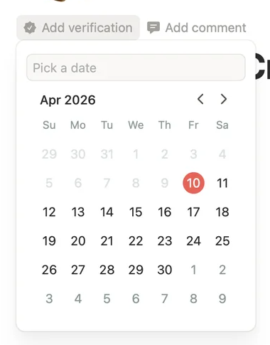
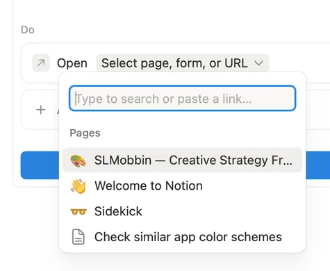
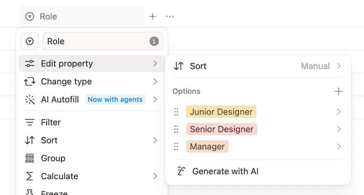
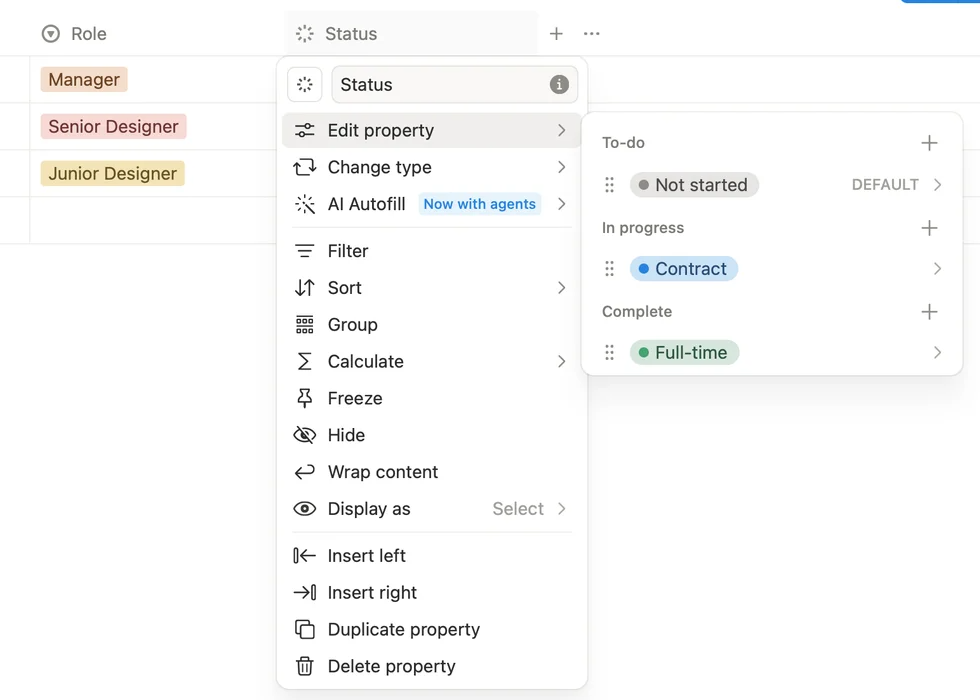
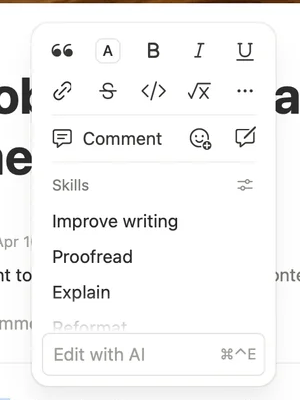
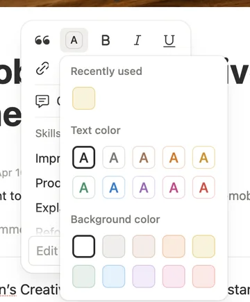
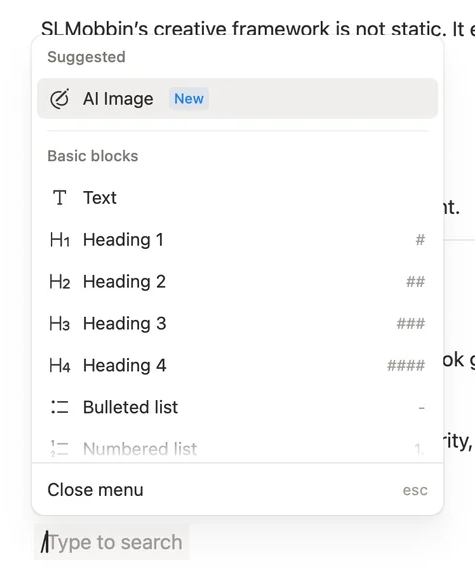
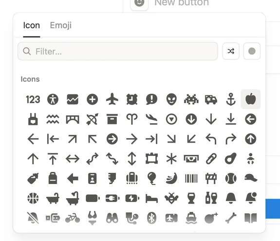
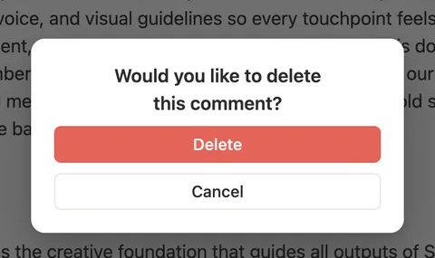

# Notion June 2026 visual findings: frames 0–300

_Last updated: 2026-09-09_

## Scope and method

Frames 0–300 inclusive from the supplied `Notion web Jun 2026` sequence were reviewed as labelled 20-frame contact sheets. Candidate states were then inspected at their original 1920 × 1320 resolution. The retained crops are unmodified source pixels. The sequence contains onboarding, AI, publishing, collaboration, and admin material that is outside Manor's scope; those screens were reviewed for filtering but not treated as product requirements.

Static screenshots establish visible layout and state only. Keyboard behavior, focus order, dismissal rules, animation, persistence, and responsive behavior below are implementation requirements or inferences, not observed facts.

## Implementation-directed findings

### 1. Property editing stays attached to the property

**Screenshot evidence.** Frame 84 uses a roughly 335 × 440 px popover directly below the triggering metadata control. A search/input row comes first, followed by a month header, previous/next controls, weekday labels, and the grid. Adjacent-month dates are lower contrast; the chosen date is a filled circle. Frame 192 uses the same attachment principle for a page/link search: the focused search field and result list open under the active action row rather than replacing the whole editor.

**Manor direction.** Task due date, context, status, priority, difficulty, and recurrence entry should use one consistent anchored-picker shell. The centered task dialog remains visible and stable while the picker opens from its field. Search belongs at the top when the option set can grow, especially Context and saved views. Do not stack a second centered modal for an ordinary property choice.

**Interaction requirements/inferences.** Arrow keys should move within results or calendar cells, Enter should commit, Escape should close only the active picker, and focus should return to the triggering field. These behaviors are not proven by the screenshots.

### 2. Semantic pills separate foreground from fill

**Screenshot evidence.** Frames 293 and 300 show short labels on pale yellow, pink, orange, gray, blue, and green fills. Text is visibly darker than its fill. Status options add a small saturated dot while retaining a pale capsule. The menu background remains neutral, so color communicates category without becoming the entire control surface.

**Manor direction.** The reported `30 min` pill with dark-green text on a dark-green fill is invalid. Difficulty/time, Context, priority, status, freeze state, and streak emphasis need semantic token pairs with independently chosen foreground and background values. A saturated green fill is acceptable only with a verified light foreground; compact metadata pills should normally use a pale tint plus a dark foreground. Do not use opacity on a single color to derive both because compositing changes contrast by theme.

**QA requirement.** Test every semantic pair in light and dark mode at the actual 12 px minimum UI size and in hover, selected, disabled, and focus states. Measure text contrast to WCAG 2.2 AA (4.5:1 for normal text) and meaningful non-text boundaries/indicators to 3:1. Color must not be the only status cue; retain label, icon shape, or position. The supplied reference frames show light mode only, so dark tokens require Manor-specific verification.

### 3. Notes controls appear at the selection and preserve the writing canvas

**Screenshot evidence.** Frame 105 places a compact two-level formatting surface immediately above the selected text. Common inline actions occupy a dense icon row; less-common writing actions sit below. Frame 106 opens color as a secondary popover beside that toolbar, splitting text colors from background colors and showing a recent choice first. Frame 143 opens the slash menu at the insertion point, with section headings, icons, labels, and right-aligned shorthand/keyboard hints; the input remains visible underneath.

**Manor direction.** Replace persistent editor chrome with selection-anchored formatting, a searchable caret-anchored slash menu, and a block-side action menu. Keep color semantics explicit: `Text color` and `Background color` are different operations. Use the DESIGN charter's plum, gray, muted teal, and restrained semantic tints rather than copying Notion's palette. The editor body must not jump when a menu opens.

**Interaction requirements/inferences.** Preserve the selection while nested menus open; Escape should close one layer at a time; typing should filter the slash list; arrow keys and Enter should work without moving the document caret. Verify clipping and placement near all viewport edges. None of this is proven by the still frames.

### 4. Icons use a searchable, layered picker

**Screenshot evidence.** Frame 185 shows Icon and Emoji tabs, a full-width filter, two small utility controls, and a dense grid. Frame 186 adds a small color sub-picker beside the selected icon without dismissing the parent. The picker is about 520 × 470 px in the source frame and holds many options without expanding the underlying form.

**Manor direction.** Context creation and editing should use the same pattern, while honoring Manor's no-emoji-as-icons rule: ship the Icon tab only, add search and curated categories, and expose semantic color as an adjacent sub-picker. Persist icon and color on the Context object so tasks, filters, boards, and dialogs reuse the same identity.

### 5. Centered dialogs need a clear hierarchy and a separate destructive shape

**Screenshot evidence.** Frame 33 dims the entire workspace and centers a roughly 920 × 850 px configuration dialog. The title and main choice dominate, secondary sections are grouped on quiet tinted surfaces, the close control sits at top right, and Reset/Done sit at bottom right. Frame 127 uses a much smaller centered confirmation dialog, with one sentence and two full-width actions; destructive red appears only on Delete.

**Manor direction.** Task details and create/edit objects should stay centered, as required by the design charter, but modal width should follow content complexity. Dense property editing needs a medium dialog with compact rows; destructive confirmation needs a small, explicit dialog. Use the primary plum action once per dialog. Reserve danger color for the destructive action and keep Cancel neutral.

**Interaction requirements/inferences.** Trap focus, place initial focus on the first meaningful field rather than the destructive button, return focus to the opener, and retain task/Note drafts after save failure. These are Manor requirements, not screenshot evidence.

### 6. Complex configuration is still one calm form

**Screenshot evidence.** Frames 184–193 show a configuration card approximately 760 px wide. It uses a plain name row, section labels (`When`, `Do`), full-width bordered action rows, generous but regular vertical spacing, and a single saturated full-width completion action at the bottom. Icon choice and destination search open as attached layers over the same form.

**Manor direction.** Recurrence, scratch block editing, and saved-filter creation can use this grammar: readable section labels, compact full-width controls, and progressive disclosure inside the dialog. Do not reproduce the source's button-automation product. For task creation, keep common fields visible; put recurrence granularity behind the recurrence row and require the exact date where the PRD requires it.

## Crop provenance

Coordinates are zero-based `(left, top, right, bottom)` in the original 1920 × 1320 PNG files.

| Crop | Source frame | Coordinates |
|---|---:|---|
| `centered-modal-frame-33.png` | 33 | `(490, 165, 1430, 1030)` |
| `date-picker-frame-84.png` | 84 | `(650, 445, 1030, 930)` |
| `inline-toolbar-frame-105.png` | 105 | `(800, 405, 1100, 805)` |
| `text-color-menu-frame-106.png` | 106 | `(800, 400, 1160, 835)` |
| `destructive-dialog-frame-127.png` | 127 | `(720, 450, 1200, 735)` |
| `slash-menu-frame-143.png` | 143 | `(645, 320, 1120, 890)` |
| `icon-picker-frame-185.png` | 185 | `(430, 370, 1005, 865)` |
| `anchored-search-frame-192.png` | 192 | `(665, 625, 1140, 1015)` |
| `semantic-pills-frame-293.png` | 293 | `(790, 200, 1535, 600)` |
| `status-pills-frame-300.png` | 300 | `(800, 200, 1780, 900)` |

## Limits

This batch has strong evidence for picker anatomy, centered modal hierarchy, contextual Notes controls, icon/color selection, and semantic pill treatment. It has no direct evidence for Manor's streak mechanics, freeze interaction, recurrence exception choices, task draft recovery, dark mode, mobile layout, or accessibility behavior. Those must be designed and tested from Manor's PRD and design charter rather than inferred from these captures.
